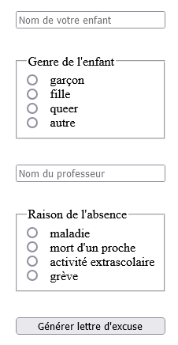

# Requirements
- PHP 8.0+ and server ([XAMPP](https://www.apachefriends.org/fr/index.html) prefered)
- This repo ;)

# Launch
Go to the root of this repository, open a terminal and execute the following command :
```sh
php -S localhost:PORT
```
PORT can be any valid 4 digits number like `5000`.

**!! Warning : if you're working with a different terminal than the one provided by XAMPP you may need to add xampp/php path to your environment variables.**

# Use
While the server is running, open a browser and go to the corresponding URL :
<http://www.localhost:5000/>

You should see the following. Fill in the form, submit and check the result by yourself.



**!! Warning : the following website is written in French.**
